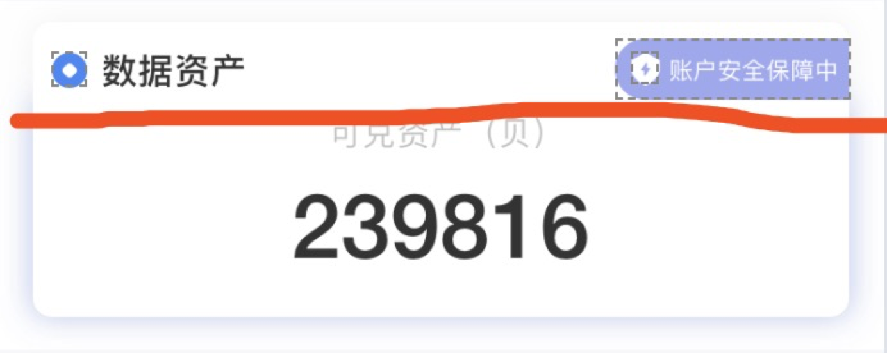

## UI需求

1. 红线以上阴影color  
	color: #000000	alpha:0.05
2. 红线以下阴影  
	color: #3E6DE3  alpha：0.33  
3. 四周圆角    

## 方案
1. 父类view控制所有圆角和第一个阴影  
```
    [self shadowWithColor:[UIColor colorWithRed:0 green:0 blue:0 alpha:0.05] opacity:1 shadowRadius:15 radius:8];
```
2. 背后加一个contentView也设置圆角和第二个阴影  

```

    CGRect shadowRect = CGRectMake(0, kMeDataScoreTopHeight, self.width, 92);
    // 阴影路径，凹形
    UIBezierPath *path = [UIBezierPath bezierPath];
    [path moveToPoint:CGPointMake(0, shadowRect.origin.y)];
    [path addLineToPoint:CGPointMake(0, shadowRect.origin.y + shadowRect.size.height)];
    [path addLineToPoint:CGPointMake(shadowRect.origin.x + shadowRect.size.width, shadowRect.origin.y + shadowRect.size.height)];
    [path addLineToPoint:CGPointMake(shadowRect.origin.x + shadowRect.size.width, shadowRect.origin.y)];
 
    self.contentView.layer.backgroundColor = [UIColor colorWithRed:255/255.0 green:255/255.0 blue:255/255.0 alpha:1.0].CGColor;
    self.contentView.layer.cornerRadius = 8;
    self.contentView.layer.shadowColor = [UIColor colorWithRed:62/255.0 green:109/255.0 blue:227/255.0 alpha:0.33].CGColor;
    self.contentView.layer.shadowOffset = CGSizeMake(0,0);
    self.contentView.layer.shadowOpacity = 1;
    self.contentView.layer.shadowRadius = 8;

    self.contentView.layer.shadowPath = path.CGPath;
```
  